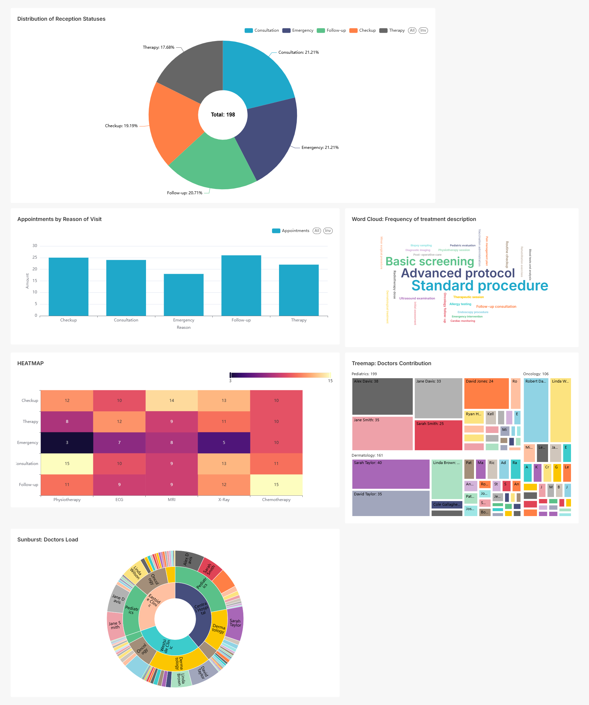
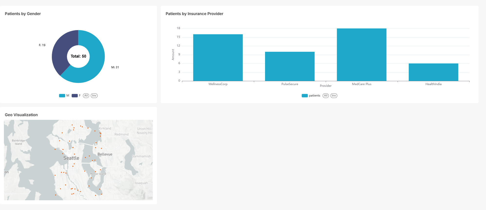
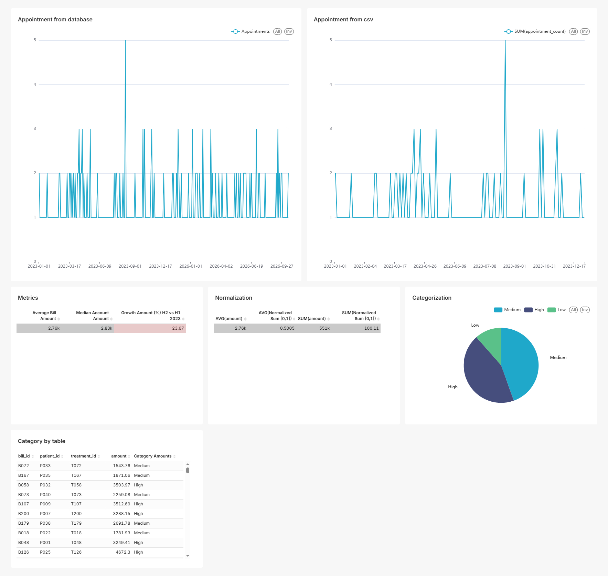
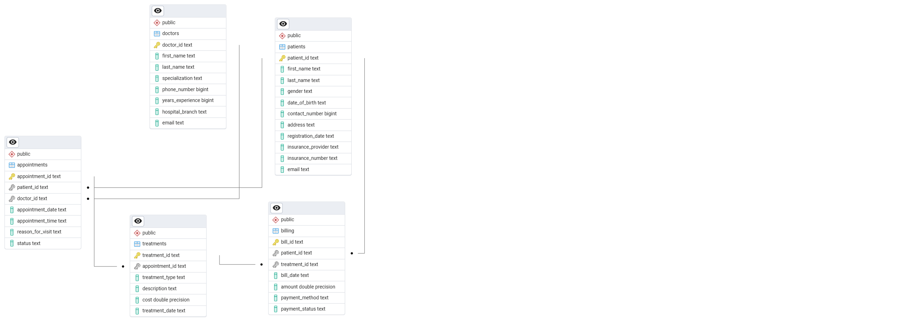

# Company Overview
**Company Name**: Dystopia  
Welcome to Dystopia, where we’re transforming healthcare with data-driven insights! We’re a healthcare analytics firm dedicated to helping hospitals and clinics operate efficiently, improve patient care, and optimize financial performance in a complex and demanding industry.

## Project Description

We’re running analytics like:
- **VIP Patients**: Identifying top patients by appointment frequency and billing to prioritize personalized care.
- **Appointment Trends**: Analyzing monthly appointment patterns in 2023 to optimize staffing and resource allocation.
- **Doctor Performance**: Ranking doctors by revenue and appointment volume to recognize high performers and inform training.
- **Payment Method Insights**: Evaluating payment methods by revenue to streamline billing processes.
- **Patient Retention**: Measuring repeat patient visits to enhance loyalty and engagement strategies.

These insights help the hospital improve patient care, operational efficiency, and financial performance in a competitive healthcare environment.

## Screenshot 




## How to Run the Project
1. **What You’ll Need**:
   - PostgreSQL (running on port 5432).
   - Python 3.12 with `pandas`, `sqlalchemy`, and `psycopg2-binary`.
   - Hospital Management Dataset CSV files (download from Kaggle: https://www.kaggle.com/datasets/kanakbaghel/hospital-management-dataset).

2. **Setup Steps**:
   - Clone the repo: ``git clone https://github.com/Zikaal/dystopia.git``
   - Install dependencies: `pip install -r requirements.txt`
   - Load data: `python load_to_postgres.py`
   - Run queries: `python main.py`

3. **Project Structure**:
```plaintext
├── charts/
│   ├── bar_top_doctors_revenue.png
│   ├── barh_avg_treatment_cost.png
│   ├── hist_bill_amounts.png
│   ├── line_monthly_appointments.png
│   ├── pie_payment_methods.png
│   ├── scatter_patient_engagement.png
├── data/
│   ├── patients.csv
│   ├── doctors.csv
│   ├── appointments.csv
│   ├── billing.csv
│   └── treatments.csv
├── images/
│   ├── placeholder.png
│   └── er_diagram.png
├── exports/
│   ├── billing_report.xlsx
├── load_to_postgres.py
├── main.py
├── interactive_graph.py
├── graph.py
├── queries.sql
├── visual_query.sql
├── requirements.txt
└── README.md
```


## Tools and Resources
- **Database**: PostgreSQL
- **Programming**: Python 3.12 (`pandas`, `sqlalchemy`, `psycopg2-binary`)
- **Visualization**: Apache Superset (to be configured)
- **Data Source**: Hospital Management Dataset (Kaggle)
- **Version Control**: Git, GitHub

## ER Diagram

